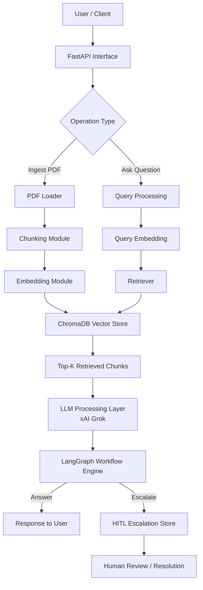

# 🚀 RAG-Based Customer Support Assistant

### AI System to Automate Customer Support with Human Escalation

> Built using LangGraph, ChromaDB, and xAI Grok  
> Designed for scalable, reliable, and explainable support automation

---

## 💡 Problem Statement

Customer support teams face:
- repetitive queries
- slow response times
- inconsistent answers

---

## 🎯 Solution

This system:
- retrieves answers from real documents (PDFs)
- generates grounded responses using LLM
- escalates uncertain queries to humans

---

## 🌍 Why This Matters

This project solves real-world problems:

- Prevents LLM hallucination
- Ensures reliable AI responses
- Introduces human safety layer
- Mimics production AI systems

👉 This is not just a chatbot — it's a controlled AI system.

## Table of Contents

- [Project Overview](#project-overview)
- [Objectives](#objectives)
- [Scope](#scope)
- [Core Concepts Applied](#core-concepts-applied)
- [System Architecture](#system-architecture)
- [Architecture Diagram](#architecture-diagram)
- [High-Level Design](#high-level-design)
- [Low-Level Design](#low-level-design)
- [Workflow Design](#workflow-design)
- [Conditional Routing Logic](#conditional-routing-logic)
- [HITL Design](#hitl-design)
- [Technology Choices](#technology-choices)
- [Project Structure](#project-structure)
- [Data Models](#data-models)
- [API Design](#api-design)
- [Setup and Installation](#setup-and-installation)
- [Running the Project](#running-the-project)
- [Sample Usage](#sample-usage)
- [Error Handling](#error-handling)
- [Testing Strategy](#testing-strategy)
- [Scalability Considerations](#scalability-considerations)
- [Challenges and Trade-offs](#challenges-and-trade-offs)
- [Current Limitations](#current-limitations)
- [Future Enhancements](#future-enhancements)

---

## Project Overview

This project implements a customer support assistant that answers user questions from a PDF knowledge base using Retrieval-Augmented Generation. Instead of relying only on a language model's internal knowledge, the system first retrieves relevant document chunks, then asks the LLM to generate an answer grounded in those retrieved passages.

The system is designed as more than a chatbot. It is a controlled AI workflow with decision-making capability:

- PDF documents are ingested and transformed into searchable vector embeddings
- user questions are matched against the indexed knowledge base
- relevant context is passed into the LLM for grounded answer generation
- a graph-based workflow decides whether to return the answer or escalate to a human
- uncertain or unsupported cases are stored in a HITL escalation queue

This aligns directly with the internship goal of building a scalable AI support system with routing and human review.

## Objectives

The main objectives of this project are:

- design a RAG pipeline for customer support
- process PDF documents into retrievable chunks
- store semantic embeddings in ChromaDB
- retrieve relevant knowledge for user queries
- generate contextual answers using xAI Grok
- orchestrate flow control with LangGraph
- apply conditional routing for answer vs escalation
- support Human-in-the-Loop escalation for low-confidence cases

## Scope

### In Scope

- single PDF ingestion via API
- semantic retrieval using embeddings
- grounded answer generation from retrieved context
- graph-based routing using LangGraph
- escalation storage and resolution workflow
- REST API for ingestion, querying, and escalation handling
- local CLI entrypoint for quick manual testing

### Out of Scope

- authentication and authorization
- multi-tenant deployment
- production observability stack
- distributed vector infrastructure
- conversation memory across sessions
- automated retraining or feedback learning loop

## Core Concepts Applied

This repository intentionally demonstrates the mandatory concepts required in the project brief:

- `RAG`: retrieve context from a knowledge base before answer generation
- `PDF -> Chunk -> Embed -> Store`: implemented using `PyPDF`, chunking, `sentence-transformers`, and `ChromaDB`
- `Query -> Retrieve -> Answer`: implemented through the support query flow
- `Graph-based workflow`: implemented using `LangGraph`
- `Conditional routing`: automated answer or human escalation
- `Customer support bot use case`: all prompts and APIs are centered on support queries
- `Human-in-the-Loop`: uncertain answers create escalation tickets in SQLite

## System Architecture

At a high level, the system contains two major pipelines:

1. Ingestion pipeline
2. Query and decision pipeline

The ingestion pipeline transforms unstructured PDFs into vector-searchable knowledge. The query pipeline retrieves the best matching chunks, asks the LLM for a grounded answer, and then uses graph-based routing logic to decide whether the answer is safe to return or should be escalated.

## Architecture Diagram



## High-Level Design

### 1. System Overview

#### Problem Definition

Customer support teams often receive repetitive questions whose answers already exist in policy PDFs, manuals, or documentation. Traditional chatbots frequently hallucinate or fail to justify answers. This system addresses that by grounding responses in retrieved document content and escalating uncertain cases to a human.

#### System Goal

Deliver accurate, context-aware answers from a PDF knowledge base while reducing hallucination risk through:

- retrieval grounding
- workflow-based control
- confidence-aware routing
- human escalation for ambiguous cases

### 2. Major Components

#### User Interface

- `FastAPI` REST endpoints for ingestion, querying, and escalation review
- `main.py` CLI for quick local interaction

#### Document Ingestion Pipeline

- accepts uploaded PDF documents
- extracts text from each page
- normalizes and chunks the extracted text
- computes embeddings for each chunk
- persists vectors and metadata in ChromaDB

#### Embedding System

- uses `sentence-transformers/all-MiniLM-L6-v2`
- generates normalized dense vector embeddings for both documents and queries

#### Vector Database

- uses `ChromaDB` persistent collections
- stores chunk text, chunk identifiers, page metadata, and embeddings

#### Retrieval Layer

- embeds the incoming question
- performs top-K semantic similarity search
- returns retrieved chunks with similarity-derived confidence scores

#### LLM Processing Layer

- uses xAI Grok through the `/responses` API
- prompts the model to answer strictly from retrieved context
- requires structured JSON output with confidence and escalation intent

#### Workflow Orchestration

- implemented with `LangGraph`
- drives the answer generation and routing lifecycle

#### HITL System

- creates escalation tickets in `SQLite`
- stores question, reason, answer draft, citations, and status
- supports human resolution via API

### 3. Data Flow

#### PDF to Knowledge Base

1. user uploads a PDF
2. system extracts text page by page
3. text is normalized and split into overlapping chunks
4. each chunk is embedded
5. embeddings and metadata are stored in ChromaDB

#### Query Lifecycle

1. user sends a support question
2. system embeds the query
3. retriever fetches top-K relevant chunks
4. retrieved context is formatted into the LLM prompt
5. LLM returns answer, confidence, and escalation flag
6. LangGraph evaluates routing conditions
7. system either returns an answer or creates an escalation ticket

## Low-Level Design

### Module-Level Design

#### Document Processing Module

File: [app/services/pdf_service.py](/d:/Projects/customer_support_agent/app/services/pdf_service.py)

- reads PDF files using `PyPDF`
- extracts text from each page
- returns page-number and text tuples

#### Chunking Module

File: [app/services/chunking.py](/d:/Projects/customer_support_agent/app/services/chunking.py)

- normalizes whitespace
- splits text into fixed-size overlapping chunks
- preserves page references and chunk indices

#### Embedding Module

File: [app/services/embedding_service.py](/d:/Projects/customer_support_agent/app/services/embedding_service.py)

- lazily loads a sentence-transformer model
- generates embeddings for document chunks and queries
- normalizes embeddings for cosine similarity use

#### Vector Storage Module

File: [app/services/vector_store.py](/d:/Projects/customer_support_agent/app/services/vector_store.py)

- creates or reuses Chroma collections by knowledge base ID
- persists chunk text, metadata, and embeddings
- retrieves top-K most similar chunks at query time

#### Query Processing Module

File: [app/application.py](/d:/Projects/customer_support_agent/app/application.py)

- accepts incoming API requests
- computes retrieval confidence
- passes query state into LangGraph
- maps domain failures to HTTP errors

#### Graph Execution Module

File: [app/graph.py](/d:/Projects/customer_support_agent/app/graph.py)

- defines graph state and workflow nodes
- invokes the LLM
- performs routing
- finalizes answer or creates escalation

#### HITL Module

File: [app/services/escalation_store.py](/d:/Projects/customer_support_agent/app/services/escalation_store.py)

- stores open and resolved escalation tickets in SQLite
- supports listing, lookup, creation, and resolution

### Data Structures

#### Document Representation

Current representation during extraction:

```python
list[tuple[int, str]]
```

Meaning:

- page number
- extracted page text

#### Chunk Format

Implemented as `TextChunk`:

```python
TextChunk(
    text: str,
    page_number: int,
    chunk_index: int
)
```

#### Retrieved Chunk Structure

Implemented as `RetrievedChunk`:

```python
RetrievedChunk(
    chunk_id: str,
    text: str,
    source_document: str,
    page_number: int | None,
    score: float,
    metadata: dict[str, Any]
)
```

#### Query Request Schema

Implemented in [app/schemas.py](/d:/Projects/customer_support_agent/app/schemas.py):

```json
{
  "question": "string",
  "knowledge_base_id": "default",
  "top_k": 4,
  "customer_id": "optional",
  "session_id": "optional"
}
```

#### Query Response Schema

```json
{
  "route": "answer | escalate",
  "answer": "string or null",
  "confidence": 0.0,
  "reasoning": "string",
  "citations": [],
  "escalation_ticket_id": "string or null"
}
```

#### Graph State

The graph state in [app/graph.py](/d:/Projects/customer_support_agent/app/graph.py) carries:

- question
- knowledge base ID
- customer and session identifiers
- top-K setting
- retrieved chunks
- retrieval confidence
- drafted answer
- LLM confidence
- escalation reason
- citations
- final route

## Workflow Design

### LangGraph Workflow

The implemented graph contains these logical stages:

```text
START
  -> draft_answer
  -> route_query
     -> finalize_answer
     -> create_escalation
END
```

### Node Responsibilities

#### `draft_answer`

- checks whether any chunks were retrieved
- formats retrieved chunks as prompt context
- calls xAI Grok
- parses JSON output
- extracts answer, citations, confidence, and LLM escalation intent

#### `route_query`

- evaluates retrieval confidence
- evaluates LLM confidence
- checks the model's escalation signal
- decides final route: `answer` or `escalate`

#### `finalize_answer`

- calculates final confidence
- returns the grounded response

#### `create_escalation`

- creates a ticket in the escalation store
- preserves draft answer and supporting context
- returns an escalation-aware response to the caller

## Conditional Routing Logic

The project brief requires conditional routing based on intent and confidence. In this implementation, the decision logic is based on operational confidence and supportability:

### Answer Generation Criteria

The system returns an automated answer when:

- relevant chunks are retrieved
- retrieval confidence meets threshold
- LLM confidence meets threshold
- the model does not request escalation

### Escalation Criteria

The system escalates when:

- no chunks are retrieved
- retrieval confidence is below `MIN_RETRIEVAL_CONFIDENCE`
- LLM confidence is below `MIN_LLM_CONFIDENCE`
- the model indicates insufficient context

This is effectively intent-aware routing for support automation: answer when grounded and safe, escalate when uncertain or unsupported.

## HITL Design

Human-in-the-Loop is a core system requirement and is implemented through a dedicated escalation module.

### When Escalation Is Triggered

- missing context
- low retrieval confidence
- low LLM confidence
- model-declared need for human review

### What Happens After Escalation

1. the system creates a unique escalation ticket
2. the question, reason, citations, and draft answer are stored
3. support staff can list and inspect escalations
4. a human can resolve the ticket with a final response

### How Human Response Is Integrated

The current implementation stores the human resolution in the escalation record and marks the ticket as resolved. This creates a clean audit trail for later review and can be extended into customer notification, analytics, or feedback loops.

## Technology Choices

### Why ChromaDB

- simple persistent vector database for local development
- easy API for storing embeddings and metadata
- well-suited for internship and prototype RAG systems
- low operational overhead compared with larger managed vector systems

### Why LangGraph

- gives explicit control over workflow steps
- clearer than a single linear script for routing and escalation decisions
- suitable for stateful AI application orchestration
- makes answer vs escalation flow easy to explain and extend

### Why xAI Grok

- supports LLM-based reasoning and structured generation
- used here to produce grounded support answers in JSON form
- fits the project requirement for contextual answer generation from retrieved evidence

### Additional Tools

- `FastAPI` for clear API design and local docs
- `SQLite` for lightweight escalation persistence
- `PyPDF` for document extraction
- `uv` for dependency management

## Project Structure

```text
customer_support_agent/
|-- app/
|   |-- application.py           # FastAPI application and route handlers
|   |-- config.py                # Environment-driven configuration
|   |-- graph.py                 # LangGraph workflow and routing logic
|   |-- schemas.py               # Request/response models
|   `-- services/
|       |-- chunking.py          # Chunking strategy
|       |-- embedding_service.py # Embedding generation
|       |-- escalation_store.py  # SQLite-backed HITL ticket store
|       |-- pdf_service.py       # PDF text extraction
|       |-- vector_store.py      # ChromaDB integration
|       `-- xai_client.py        # xAI API client
|-- data/                        # Runtime data storage
|-- main.py                      # Local CLI entrypoint
|-- pyproject.toml               # Project metadata and dependencies
`-- README.md                    # Project documentation
```

## Data Models

### Ingestion Response

```json
{
  "knowledge_base_id": "default",
  "filename": "knowledge-base.pdf",
  "chunks_indexed": 42,
  "pages_processed": 8
}
```

### Escalation Ticket

```json
{
  "id": "uuid",
  "knowledge_base_id": "default",
  "question": "What is the refund policy?",
  "reason": "The model confidence is too low for an automated answer.",
  "status": "open",
  "answer_draft": "Draft answer",
  "customer_id": "optional",
  "session_id": "optional",
  "created_at": "timestamp",
  "updated_at": "timestamp",
  "context": [],
  "human_response": null
}
```

## API Design

### Base URL

`/api/v1`

### Endpoints

#### Health Check

```http
GET /health
```

#### Ingest Knowledge Base PDF

```http
POST /api/v1/knowledge-bases/ingest
```

#### Get Knowledge Base Summary

```http
GET /api/v1/knowledge-bases/{knowledge_base_id}
```

#### Query Support Assistant

```http
POST /api/v1/support/query
```

#### List Escalations

```http
GET /api/v1/escalations
```

#### Get Escalation by ID

```http
GET /api/v1/escalations/{ticket_id}
```

#### Resolve Escalation

```http
POST /api/v1/escalations/{ticket_id}/resolve
```

## Setup and Installation

### Prerequisites

- Python `3.12+`
- `uv`
- xAI API key

### Install Dependencies

```powershell
uv sync
```

### Environment Variables

Create a `.env` file in the project root:

```env
XAI_API_KEY=your_xai_api_key
XAI_MODEL=grok-4.20-reasoning
XAI_BASE_URL=https://api.x.ai/v1
XAI_TEMPERATURE=0.1
XAI_MAX_OUTPUT_TOKENS=900

EMBEDDING_MODEL_NAME=sentence-transformers/all-MiniLM-L6-v2
EMBEDDING_BATCH_SIZE=32

CHUNK_SIZE=1200
CHUNK_OVERLAP=200
RETRIEVAL_TOP_K=4
MIN_RETRIEVAL_CONFIDENCE=0.45
MIN_LLM_CONFIDENCE=0.60

DATA_DIR=data
UPLOADS_DIR=data/uploads
CHROMA_DIR=data/chroma
ESCALATION_DB_PATH=data/escalations.sqlite3
```

## Running the Project

### Start the API Server

```powershell
uv run uvicorn app.application:app --reload
```

Available locally at:

- `http://127.0.0.1:8000`
- `http://127.0.0.1:8000/docs`

### Run the CLI

```powershell
uv run python main.py
```

The CLI is useful for quick manual testing of the retrieval and routing flow without opening the API docs.

## Sample Usage

### Ingest a PDF

```powershell
curl.exe -X POST "http://127.0.0.1:8000/api/v1/knowledge-bases/ingest" `
  -F "file=@D:\path\to\knowledge-base.pdf"
```

### Ask a Support Question

```powershell
curl.exe -X POST "http://127.0.0.1:8000/api/v1/support/query" `
  -H "Content-Type: application/json" `
  -d "{\"knowledge_base_id\":\"default\",\"question\":\"What is the refund policy?\",\"top_k\":4,\"customer_id\":\"cust-001\",\"session_id\":\"sess-001\"}"
```

### Resolve an Escalation

```powershell
curl.exe -X POST "http://127.0.0.1:8000/api/v1/escalations/<ticket-id>/resolve" `
  -H "Content-Type: application/json" `
  -d "{\"human_response\":\"Please process the refund manually as per policy.\"}"
```

## Error Handling

The current implementation addresses several failure modes:

- invalid file uploads return `400`
- missing escalation tickets return `404`
- upstream xAI API issues return `502`
- unexpected processing errors return `500`
- missing `XAI_API_KEY` fails fast before LLM requests
- no retrieved chunks leads to controlled escalation instead of hallucinated answers

## Testing Strategy

Recommended testing strategy for this project:

- unit tests for chunking, retrieval scoring, and escalation store behavior
- integration tests for PDF ingestion and support query endpoints
- prompt-output validation tests for JSON parsing robustness
- manual scenario testing with known support FAQs

### Sample Test Queries

- "What is the refund policy?"
- "How long does shipping take?"
- "Can I change my billing address after ordering?"
- "My case is unusual and not listed in the policy. What should I do?"

### What to Validate

- relevant chunks are retrieved for known answers
- citations correspond to source chunks
- low-confidence queries trigger escalation
- human resolution updates the escalation record correctly

## Scalability Considerations

### Handling Large Documents

- use chunk overlap to reduce context fragmentation
- split ingestion into background jobs for very large PDFs
- support batch ingestion for multiple documents

### Increasing Query Load

- cache embeddings and hot queries
- move ChromaDB to a stronger serving setup if needed
- horizontally scale the API layer

### Latency Concerns

- embedding inference can be expensive on large batches
- vector retrieval is fast, but LLM calls dominate end-to-end latency
- prompt size must be managed carefully as top-K grows

## Challenges and Trade-offs

### Retrieval Accuracy vs Speed

Higher `top_k` may improve recall but increases prompt size and latency.

### Chunk Size vs Context Quality

Large chunks preserve context but may dilute relevance. Small chunks improve precision but can lose surrounding meaning.

### Cost vs Performance

Stronger LLM prompting and larger retrieved context may improve answer quality, but they increase latency and token usage.

### Simplicity vs Extensibility

The current design is intentionally compact for clarity and internship evaluation, but can be extended into a more production-ready architecture over time.

## Current Limitations

These are useful to acknowledge honestly in a professional submission:

- ingestion currently stores content under the `"default"` knowledge base
- the support query helper internally uses the default knowledge base path
- there is no authentication or role-based access for escalation endpoints
- there is no automated test suite in the repository yet
- observability, metrics, and tracing are not implemented
- escalation resolution is stored, but not fed back into retrieval or answer learning

## Future Enhancements

- true multi-document and multi-knowledge-base support
- conversational memory and session continuity
- reranking layer before LLM generation
- background ingestion jobs
- admin dashboard for escalation handling
- feedback loop from resolved tickets into the knowledge base
- containerized deployment and CI/CD pipeline
- production monitoring, tracing, and audit logging

## Conclusion

This project demonstrates the design and implementation of a RAG-based customer support assistant with graph-driven workflow control and Human-in-the-Loop escalation. It reflects the key ideas expected in the internship brief:

- understanding of RAG system design
- application of LangGraph for workflow control
- conditional routing for answer vs escalation
- practical HITL integration
- structured technical thinking across HLD, LLD, and documentation

It reflects production-level understanding of:
RAG systems, LLM orchestration, and scalable backend design.

---

## 👤 Author

**Shital Bhokare**  
AI/ML & Generative AI Developer  

🔗 GitHub: https://github.com/ShitalBhokare  
🔗 LinkedIn: https://www.linkedin.com/in/shital-bhokare-798262352/

---
